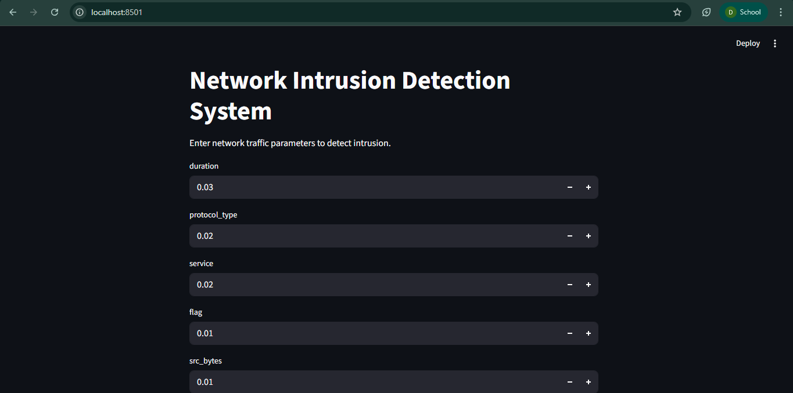
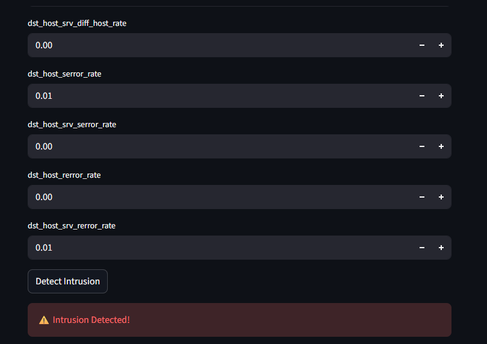
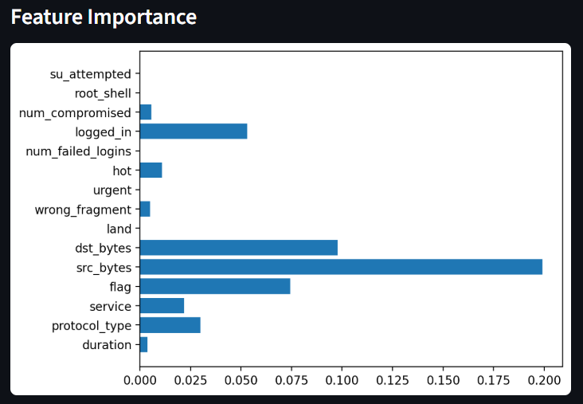

# Network Intrusion Detection System


## Overview
This project uses Machine Learning to detect malicious network traffic and identify potential cyber attacks. It is trained on the NSL-KDD dataset.

It provides:

- Binary classification (Normal vs Attack)  
- Feature importance visualization  
- Real-time prediction using an interactive Streamlit dashboard  

---

## Features
- Data preprocessing and encoding  
- Random Forest classifier  
- Confusion matrix visualization  
- Feature importance analysis  
- Real-time prediction system  
- Interactive Streamlit dashboard  

---

## Dataset
NSL-KDD dataset used for network intrusion detection research.

- **Training set:** KDDTrain+.txt  
- **Testing set:** KDDTest+.txt  

---

## Technologies Used
- Python
- Pandas
- Scikit-learn
- Matplotlib
- Seaborn
- Streamlit

---

## Model Performance
- Accuracy: ~99.86%  
- Confusion Matrix and Classification Report generated  

---

## Screenshots


**Dashboard Input Screen**  


**Intrusion Detected Example**  


**Feature Importance**  



> ⚠️ Note: You will need to generate these screenshots and save them in a `screenshots/` folder.

---

## Sample Predictions

| Feature Input Example | Prediction |
|----------------------|------------|
| Sample network traffic values | attack |
| Sample network traffic values | normal |

---

## How to Run

### 1️⃣ Train Model
```bash
python intrusion_detection.py
